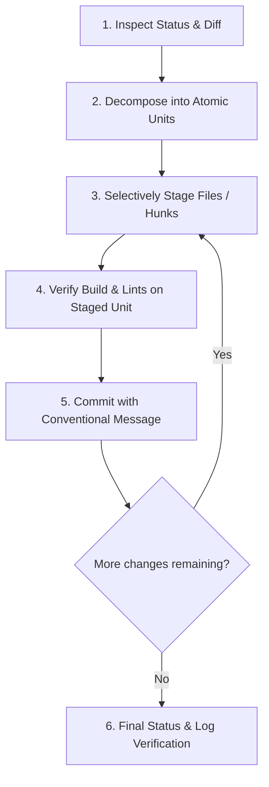

# Atomic Commit Workflow & Best Practices

An **atomic commit** encapsulates a single logical change, unit of work, or bug fix in its entirety. Every commit in the repository history should leave the codebase in a working, compilable, and test-passing state.

---

## 1. Core Principles of Atomic Commits

1. **Single Responsibility Principle (SRP):**
   A commit does _one thing_. If a commit description requires the word "and" to join two unrelated tasks, it should be split into multiple commits.
2. **Bisectability & Rollback Safety:**
   Every single commit must build, pass linting, and pass unit tests independently. A developer or CI system must be able to `git bisect` or `git revert` any commit without breaking unrelated features.
3. **Separate Structure from Semantics (No Mixing Refactor with Features):**
   - Never combine code formatting/renaming/refactoring with functional behavior changes or bug fixes.
   - If a feature requires refactoring existing code, make the refactor commit first, then add the feature commit.
4. **Intentional Staging:**
   Never blindly run `git add .` or `git add -A`. Inspect diffs explicitly and stage files (or hunks) that belong strictly to the single logical unit.

---

## 2. Conventional Commit Specification

Follow the standard [Conventional Commits](https://www.conventionalcommits.org/) format:

```
<type>(<optional-scope>): <short imperative description>

[optional body: motivation, context, and details]

[optional footer(s): breaking changes, issue references]
```

### Commit Types

| Type       | Purpose                                                   | Example                                                 |
| :--------- | :-------------------------------------------------------- | :------------------------------------------------------ |
| `feat`     | New feature or capability for the user/system             | `feat(events): add operational window validation`       |
| `fix`      | Bug fix or error resolution                               | `fix(auth): handle expired refresh token redirect`      |
| `refactor` | Code restructuring without altering external behavior     | `refactor(db): extract supabase client singleton`       |
| `test`     | Adding, updating, or correcting automated tests           | `test(ballot): add unit tests for ranked-choice tally`  |
| `docs`     | Documentation updates (README, guides, API specs)         | `docs(onboarding): add database migration steps`        |
| `style`    | Formatting, whitespace, semicolon fixes (no code changes) | `style(ui): format tailwind class ordering`             |
| `perf`     | Performance improvement (query optimization, memoization) | `perf(feed): add indexing for live vote aggregation`    |
| `chore`    | Maintenance, config changes, dependencies, scripts        | `chore(deps): update prisma to v6.5.0`                  |
| `ci`       | CI/CD pipeline, GitHub Actions, workflows                 | `ci(github): add pull request lint and test workflow`   |
| `revert`   | Reverting a previous commit                               | `revert: feat(events): revert event status transitions` |

### Subject Line Rules

- Use imperative, present-tense mood ("add", "fix", "refactor" — not "added", "fixing", "adds").
- Lowercase first letter after the colon.
- Do not end with a period (`.`).
- Keep under 72 characters.

---

## 3. Step-by-Step Atomic Commit Execution Loop

When preparing commits for a set of modified or untracked files, follow this sequence:



### Step 1: Inspect Changes

Inspect all modified, created, and deleted files:

```bash
git status -s
git diff
```

### Step 2: Decompose into Logical Slices

Order changes logically from foundation to interface:

1. **Dependencies / Configs / Tooling** (`chore`, `build`, `ci`)
2. **Database Schema & Migrations** (`feat(db)`, `fix(schema)`)
3. **Core Services / Domain Models / Repositories** (`feat(api)`, `refactor(core)`)
4. **UI Components & User Interfaces** (`feat(ui)`, `fix(views)`)
5. **Tests & Documentation** (`test(...)`, `docs(...)`)

### Step 3: Selectively Stage Files

Stage only files belonging to unit 1:

```bash
git add src/lib/db.ts prisma/schema.prisma prisma/migrations/
```

_Tip: If one file contains both a bug fix and an unrelated clean-up, use patch staging (`git add -p`) to isolate the changes._

### Step 4: Verification Gate

Before running `git commit`, verify that the staged files compile and pass lints:

```bash
# Verify TypeScript / linter
npm run lint
# Verify tests for the touched area
npm run test
```

### Step 5: Author the Commit

Commit with a clear, descriptive message:

```bash
git commit -m "feat(db): configure supabase client and generate prisma schema"
```

### Step 6: Repeat Until Clean

Repeat Steps 3–5 for the next slice until `git status` is clean.

---

## 4. Anti-Patterns & Red Flags

| ❌ Anti-Pattern                                                          | Why It Hurts                                                          | ✅ Atomic Solution                                                                  |
| :----------------------------------------------------------------------- | :-------------------------------------------------------------------- | :---------------------------------------------------------------------------------- |
| **"Mega-Commit" / "End of Day"** (`git add . && git commit -m "update"`) | Impossible to code review, breaks `git bisect`, hard to cherry-pick.  | Group by logical feature or component and commit progressively.                     |
| **Mixed Formatting & Logic**                                             | Diffs become noisy, disguising genuine logic changes and bugs.        | Submit a separate `style` or `refactor` commit prior to the logic change.           |
| **Broken Intermediate State**                                            | Commit A adds code that imports non-existent files added in Commit B. | Ensure every single commit compiles independently.                                  |
| **Accidental Artifacts** (`.env.local`, debug logs, node_modules)        | Leaks credentials or pollutes repo history.                           | Update `.gitignore` and review `git status` before committing.                      |
| **Vague Commit Messages** ("wip", "fixed bug", "changes")                | Provides zero context for future engineers reading `git blame`.       | Specify component and behavior: `fix(auth): prevent infinite redirect loop on 401`. |

---

## 5. Antigravity Agent Guidelines

When acting on behalf of the user or advising on commits:

1. **Always inspect the current git diff and staged files** before committing.
2. **Propose the commit breakdown plan** to the user if multiple distinct changes exist.
3. **Verify type-check and lint status** before executing the commit.
4. **Never include secrets, `.env` files, or unneeded build artifacts**.
