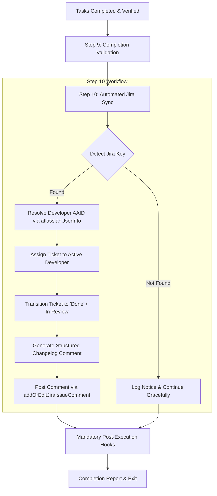

# ADR-001: Automated Jira Ticket Synchronization & Changelog in Spec-Kit Implement

- **Status**: Accepted
- **Date**: 2026-09-26
- **Deciders**: Roselle Tabuena, Electa Engineering Team
- **Technical Area**: Developer Tooling, Spec-Driven Development (SDD), Agile Governance

---

## 1. Context & Problem Statement

Electa follows **Spec-Driven Development (SDD)** with Spec-Kit (`/speckit-specify` → `/speckit-plan` → `/speckit-tasks` → `/speckit-implement`) and uses **Jira Software Cloud** (project `VS`) for agile sprint management, epic breakdown, and progress tracking.

Previously, completing a feature implementation via `/speckit-implement` required multiple manual developer actions:

1. **Manual Board Updates**: Navigating to the Jira web UI or making separate tool calls to transition the ticket from _In Progress_ to _Done_.
2. **Manual Assignee Tagging**: Manually claiming or verifying ticket ownership.
3. **Loss of Traceability**: Summaries of completed work, specific commit hashes, and verified acceptance criteria were often omitted from Jira, breaking the audit trail between Git history and project management.
4. **Context Switching**: Friction between terminal/IDE development and Jira board grooming.

---

## 2. Decision

We have decided to integrate **Automated Jira Ticket Synchronization & Implementation Commenting** directly into the final stage (Step 10) of the **`speckit-implement`** workflow skill ([`vote-sphere/.agents/skills/speckit-implement/SKILL.md`](../.agents/skills/speckit-implement/SKILL.md)).

### Architectural Workflow

### Specific Integration Requirements

1. **Deterministic Key Detection Hierarchy**:
   - Priority 1: User argument override in `$ARGUMENTS` (e.g., `/speckit-implement VS-19`).
   - Priority 2: Frontmatter / header in `spec.md` (`**Jira Key**: VS-XX`).
   - Priority 3: `tasks.md`, `plan.md`, or `docs/tickets/` matching pattern `VS-\d+` or `[A-Z]+-\d+`.
   - Priority 4: Git branch name (e.g., `feature/VS-19-...`) or recent commit messages (`git log -n 5 --oneline`).

2. **Automated State Transition**:
   - The ticket must be moved to **Done** (or **In Review** if formal review gates are enabled) using `listJiraIssueTransitions` / `transitionJiraIssue`.
   - Assignee must be automatically claimed by the active developer via `atlassianUserInfo`.

3. **Standardized Changelog Comment Structure**:
   - Every completed ticket receives an automatic Jira comment containing:
     - **Fulfilled Acceptance Criteria**: Verified against `spec.md`.
     - **Completed Tasks Checklist**: Extracted from `tasks.md`.
     - **Git Commit Traceability**: Hashes and titles of all commits created during the implementation.
     - **Test Suite Verification**: Output summary of passing test suites (`vitest`).

4. **Non-Blocking Fault Tolerance**:
   - If no Jira key is identified, or if the Atlassian MCP server is temporarily unreachable, the workflow logs a warning and completes without failing the core code implementation.

---

## 3. Consequences

### Positive Impacts

- **Zero-Friction Jira Hygiene**: Eliminates human error and board staleness. Tickets are closed the exact second code and tests pass.
- **Bi-Directional Auditability**: Seamless linking between Git commits, Spec-Kit tasks, acceptance criteria, and Jira tickets.
- **Enhanced Team Visibility**: Product managers and stakeholders get immediate, rich status updates on coronation and school voting deliverables without asking engineers for status checks.

### Negative Impacts & Mitigations

- **Dependency on Atlassian MCP**:
  - _Mitigation_: Fallback logic ensures local implementation, Git commits, and code changes are never blocked if the Jira API is unreachable.
- **Potential Key Collisions**:
  - _Mitigation_: Strict regex parsing and explicit prioritization of `spec.md` header keys over loose branch names.
