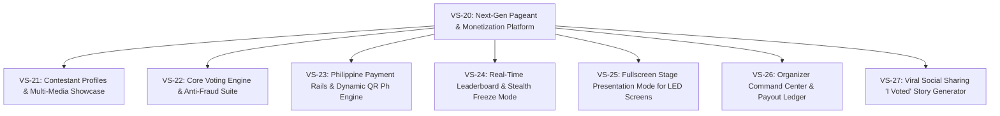
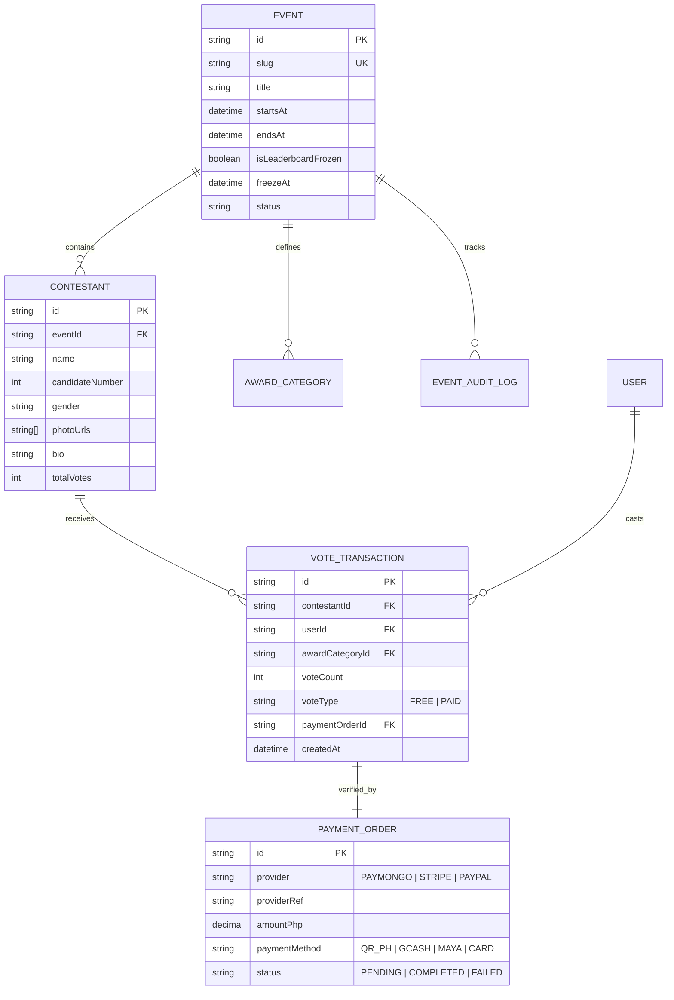

# [EPIC-VS-20] VoteSphere: Next-Gen Pageant & Event Monetization Platform

> **Jira Epic Key**: `VS-20`  
> **Type**: Epic  
> **Status**: Ready for Backlog Grooming  
> **Target Release**: Q4 2026 / Phase 2 Launch  
> **Target Audience**: Pageant Organizers (LGUs, Universities, Private Agencies), Pageant Candidates, Voters & Fanbases (Local PH & OFW Diaspora)  
> **Competitive Target**: Pageant Vote PH (`pageantvoteph.com`) & Pageant Central

---

## 🎯 1. Executive Summary & Objective

Build an ad-free, real-time, luxury event voting and monetization platform for beauty pageants, university coronation nights, and community awards.

VoteSphere disrupts the legacy market (Pageant Vote PH) by replacing outdated 2015-era architecture and intrusive Google AdSense banners with a **Next.js 16 + Tailwind 4** luxury design system, **Universal Omnichannel Auth** (eliminating Facebook-only lock-in), **Native Philippine Payment Rails** (QR Ph, GCash, Maya), **Real-Time Supabase Leaderboards**, and **Viral Social Share Loops**.

---

## 💼 2. Business Value & Success Metrics (KPIs)

```
┌─────────────────────────────────────────────────────────────────────────────┐
│                            BUSINESS TARGETS                                  │
│  • 10% - 15% Platform Take-rate on Paid Vote Boosts                        │
│  • > 40% Increase in Free-Vote Conversion (via Multi-Auth vs Facebook only)  │
│  • < 5s Checkout Completion with Dynamic QR Ph & Deep-linked GCash/Maya    │
│  • 100% Ad-Free UI (Whitelabel Organizer & Sponsor branding only)           │
│  • Sub-100ms Live Leaderboard Propagation via Supabase Realtime Channels   │
└─────────────────────────────────────────────────────────────────────────────┘
```

---

## 🧱 3. Epic Breakdown: Child User Stories & Tickets



---

### 🎟️ Ticket VS-21: Contestant Profiles & Multi-Category Roster

- **Priority**: High (P1)
- **Story Points**: 5
- **Description**: As a voter or contestant, I want rich candidate profiles with high-resolution photo galleries, bio/advocacy statements, social media links, and category tagging (Male, Female, LGBTQ+, Teen) so I can showcase my candidacy and learn about candidates.
- **Acceptance Criteria**:
  - [ ] Support up to 10 high-resolution photos per candidate with client-side aspect cropping and CDN optimization.
  - [ ] Bio fields for candidate number, hometown, advocacy statement, height, and verified social links (IG, TikTok, FB).
  - [ ] Multi-category tagging: Contestants can be grouped by division (e.g. Male vs Female) or award categories (e.g. _People's Choice_, _Best in Swimsuit_, _Best in Evening Gown_).
  - [ ] Embedded video reel / TikTok / YouTube Shorts player support.

---

### 🎟️ Ticket VS-22: Core Voting Engine, Omnichannel Auth & Anti-Fraud

- **Priority**: Critical (P0)
- **Story Points**: 8
- **Description**: As a platform operator, I want a secure, fair voting engine supporting both free daily votes and paid boosts with multi-provider auth and bot deterrence.
- **Acceptance Criteria**:
  - [ ] **Multi-Provider Auth**: Support Google OAuth, Apple Sign-In, Email Magic Links, Phone OTP (SMS/WhatsApp), and Facebook OAuth.
  - [ ] **Free Daily Voting Rule**: Enforce 1 free vote per authenticated voter per 24 hours (or per operational window) with device fingerprinting and IP velocity check.
  - [ ] **Bot Mitigation**: Cloudflare Turnstile verification required for free vote submissions.
  - [ ] **Data Integrity**: Atomic database transactions ensuring zero double-counting or race conditions during high-concurrency voting rushes.

---

### 🎟️ Ticket VS-23: Philippine Payment Rails & Dynamic QR Ph Engine

- **Priority**: Critical (P0)
- **Story Points**: 8
- **Description**: As a fan/supporter, I want to purchase vote packages ("Boosts") instantly using Philippine e-wallets, bank apps via QR Ph, or international credit cards.
- **Acceptance Criteria**:
  - [ ] **Pricing Tiers**:
    - ₱50 (5 votes)
    - ₱100 (10 votes)
    - ₱250 (26 votes — +1 bonus)
    - ₱500 (55 votes — +5 bonus)
    - ₱1,000 (115 votes — +15 bonus)
    - ₱2,500 (300 votes — +50 bonus)
    - ₱5,000 (625 votes — +125 bonus)
    - ₱10,000 (1,300 votes — +300 bonus)
    - Custom vote slider with real-time price & bonus calculator.
  - [ ] **Payment Gateways**:
    - **QR Ph Dynamic Code**: Generated on-screen; scannable by GCash, Maya, BDO, BPI, UnionBank, GoTyme, and all BSP-compliant apps.
    - **Mobile 1-Tap Deep Link**: Seamless handoff to GCash/Maya app on mobile browsers.
    - **International Cards & PayPal**: Stripe & PayPal for OFW/overseas voters.
  - [ ] **Webhook Pipeline**: Secure signature validation, idempotency caching, and automated vote credit within 500ms of payment authorization.
  - [ ] **Voter Receipt**: Instant digital receipt card with reference number and downloadable proof.

---

### 🎟️ Ticket VS-24: Real-Time Live Leaderboard & Stealth Mystery Freeze

- **Priority**: High (P1)
- **Story Points**: 5
- **Description**: As an organizer and voter, I want real-time live ranking updates with dynamic podium animations and the ability to freeze public rankings before the grand finals.
- **Acceptance Criteria**:
  - [ ] **Live Realtime Ticker**: Supabase Realtime channel updates candidate vote totals and rank positions instantly without manual page refreshes.
  - [ ] **Top 3 Podium**: Gold, Silver, Bronze highlighted visual cards with vote gap indicators ("Needs 12 votes to take 1st!").
  - [ ] **Stealth Freeze Mode**: Organizer can schedule or manually trigger a "Mystery Freeze Window" (e.g. 2 hours before coronation). Public leaderboard shows "Rankings Hidden for Live Stage Announcement", while back-end voting continues to accept paid and free votes.
  - [ ] **Category Switching**: Seamless tab filtering across Male, Female, and specialized award tracks (_Best in Swimsuit_, _People's Choice_).

---

### 🎟️ Ticket VS-25: Fullscreen Stage Presentation Mode for LED Screens

- **Priority**: Medium (P2)
- **Story Points**: 3
- **Description**: As a pageant director, I want a dedicated fullscreen presentation view formatted for stage LED walls (16:9 / 4K) to show live tallies and dramatic rank reveals during rehearsals and coronation night.
- **Acceptance Criteria**:
  - [ ] Dedicated URL route: `/events/:slug/stage-display`.
  - [ ] High-contrast dark luxury theme optimized for big-screen projectors and LED backdrops.
  - [ ] Animated winner reveal sequences with sound effect triggers and celebratory confetti/particle effects.

---

### 🎟️ Ticket VS-26: Organizer Command Center, Revenue Tracker & Payout Ledger

- **Priority**: High (P1)
- **Story Points**: 5
- **Description**: As a pageant organizer, I want a self-service dashboard to monitor real-time gross vote revenues, gateway fees, platform commissions, net payout balance, and fraud logs.
- **Acceptance Criteria**:
  - [ ] Real-time financial dashboard: Gross Sales, Payment Gateway Processing Fees, VoteSphere Take-Rate (12%), Net Organizer Revenue.
  - [ ] Exportable audit logs (CSV / PDF) with timestamped vote transactions, payment references, and voter IP hashes.
  - [ ] Contestant management panel (add, edit, hide contestants, re-order candidate numbers).
  - [ ] Payout request interface with automated bank / GCash disbursement tracking.

---

### 🎟️ Ticket VS-27: Viral Social Sharing "I Voted" Story Generator

- **Priority**: Medium (P2)
- **Story Points**: 3
- **Description**: As a voter, I want a downloadable 9:16 Instagram/TikTok/Facebook Story card immediately after voting so I can campaign for my favorite candidate on my personal social channels.
- **Acceptance Criteria**:
  - [ ] Post-vote modal generates a high-resolution 9:16 Canvas/SVG image:
    - Contestant portrait & candidate number.
    - "I Voted for [Name]!" badge.
    - Dynamic QR code linking directly to the candidate's voting URL.
  - [ ] 1-Tap "Share to Instagram Stories" / "Download Story Image" / "Copy Direct Link" buttons.

---

## 🛠️ 4. Technical Architecture & Data Models



---

## 📋 5. Implementation Phasing & Next Steps

| Phase                   | Epics / Stories                                                                    | Deliverable                                                                    |
| :---------------------- | :--------------------------------------------------------------------------------- | :----------------------------------------------------------------------------- |
| **Phase 1 (Completed)** | `001-event-operational-window`                                                     | Core event domain, time validation, audit logging, public event page skeleton. |
| **Phase 2 (Sprint 1)**  | `VS-21` (Contestant Profiles) & `VS-22` (Voting Engine)                            | Multi-photo gallery, category tagging, multi-auth, 24h daily free voting.      |
| **Phase 3 (Sprint 2)**  | `VS-23` (Payment Rails) & `VS-24` (Real-Time Leaderboard)                          | QR Ph / GCash / Maya checkout, Supabase Realtime leaderboard, stealth freeze.  |
| **Phase 4 (Sprint 3)**  | `VS-25` (Stage Display), `VS-26` (Organizer Dashboard), `VS-27` (Viral Story Card) | Organizer payouts, full stage presentation mode, viral growth loops.           |
