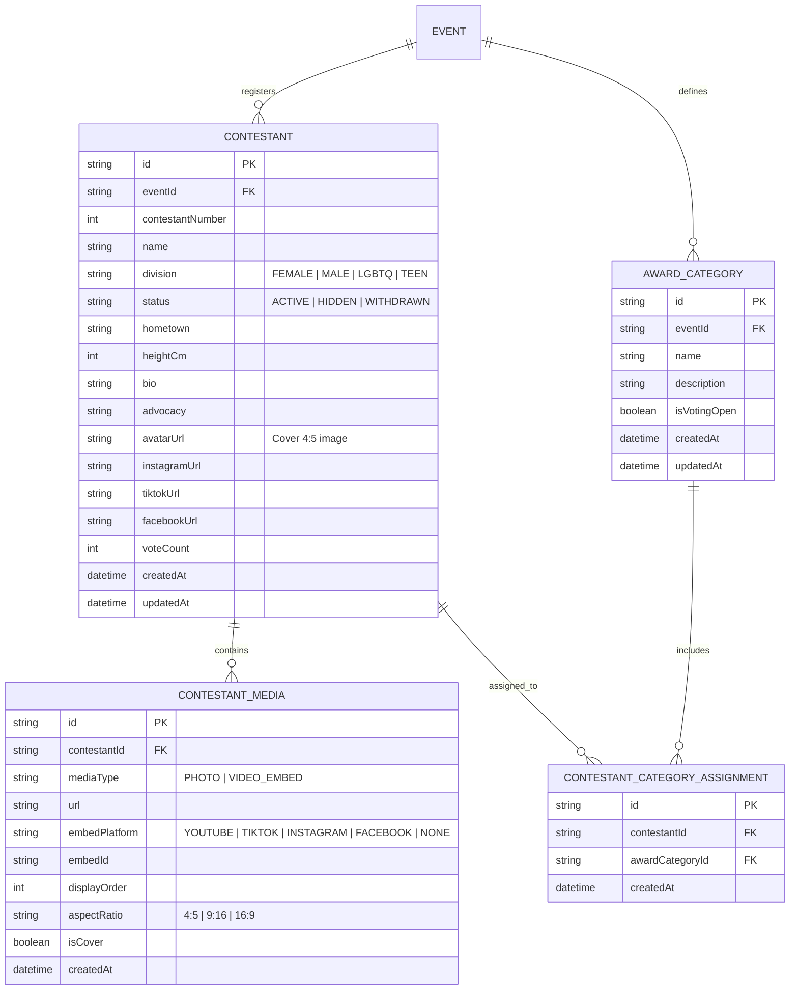

# Data Model & Schema Specification: Contestant Profiles & Media Showcase

**Feature**: `002-contestant-profiles`  
**Status**: Ready for Implementation  
**Date**: 2026-09-26

---

## 1. Entity Relationship Diagram



---

## 2. Prisma Schema Definitions

```prisma
enum ContestantDivision {
  FEMALE
  MALE
  LGBTQ
  TEEN
}

enum ContestantStatus {
  ACTIVE
  HIDDEN
  WITHDRAWN
}

enum MediaType {
  PHOTO
  VIDEO_EMBED
}

enum EmbedPlatform {
  YOUTUBE
  TIKTOK
  INSTAGRAM
  FACEBOOK
  NONE
}

model Contestant {
  id               String                 @id @default(uuid())
  eventId          String
  contestantNumber Int
  name             String
  division         ContestantDivision     @default(FEMALE)
  status           ContestantStatus       @default(ACTIVE)
  hometown         String?
  heightCm         Int?
  bio              String?
  advocacy         String?
  avatarUrl        String
  instagramUrl     String?
  tiktokUrl        String?
  facebookUrl      String?
  voteCount        Int                    @default(0)
  createdAt        DateTime               @default(now())
  updatedAt        DateTime               @updatedAt

  event            Event                  @relation(fields: [eventId], references: [id], onDelete: Cascade)
  media            ContestantMedia[]
  categories       ContestantCategoryAssignment[]

  @@unique([eventId, division, contestantNumber])
  @@index([eventId, status])
  @@index([eventId, division])
}

model ContestantMedia {
  id            String         @id @default(uuid())
  contestantId  String
  mediaType     MediaType      @default(PHOTO)
  url           String
  embedPlatform EmbedPlatform  @default(NONE)
  embedId       String?
  displayOrder  Int            @default(0)
  aspectRatio   String         @default("4:5")
  isCover       Boolean        @default(false)
  createdAt     DateTime       @default(now())

  contestant    Contestant     @relation(fields: [contestantId], references: [id], onDelete: Cascade)

  @@index([contestantId, displayOrder])
}

model AwardCategory {
  id           String                        @id @default(uuid())
  eventId      String
  name         String
  description  String?
  isVotingOpen Boolean                       @default(true)
  createdAt    DateTime                      @default(now())
  updatedAt    DateTime                      @updatedAt

  event        Event                         @relation(fields: [eventId], references: [id], onDelete: Cascade)
  contestants  ContestantCategoryAssignment[]

  @@unique([eventId, name])
  @@index([eventId])
}

model ContestantCategoryAssignment {
  id              String        @id @default(uuid())
  contestantId    String
  awardCategoryId String
  createdAt       DateTime      @default(now())

  contestant      Contestant    @relation(fields: [contestantId], references: [id], onDelete: Cascade)
  awardCategory   AwardCategory @relation(fields: [awardCategoryId], references: [id], onDelete: Cascade)

  @@unique([contestantId, awardCategoryId])
  @@index([contestantId])
  @@index([awardCategoryId])
}
```

---

## 3. Data Integrity & Validation Rules

| Field / Entity        | Rule / Constraint                                                                       | Error Behavior                                                                                 |
| :-------------------- | :-------------------------------------------------------------------------------------- | :--------------------------------------------------------------------------------------------- |
| `contestantNumber`    | Must be an integer >= 1. Unique per `(eventId, division)`.                              | 400 Bad Request / Form validation error ("Candidate number already assigned in this division") |
| `media` gallery items | Maximum 10 photos per contestant.                                                       | 400 Bad Request ("Maximum of 10 photos allowed")                                               |
| `aspectRatio`         | 4:5 Portrait Standard enforced on cover photos and cropped gallery items.               | Validated in client cropper before payload submission                                          |
| `videoEmbedUrl`       | Must match valid YouTube, TikTok, Instagram, or Facebook URL regex.                     | 400 Bad Request ("Invalid or unsupported video URL format")                                    |
| `advocacy`            | Max 1,000 characters.                                                                   | Zod schema validation error                                                                    |
| `socialLinks`         | Auto-sanitized to valid HTTPS URLs or `@` handle formats.                               | Normalized on save                                                                             |
| `status`              | Defaults to `ACTIVE`. When `WITHDRAWN` or `HIDDEN`, excluded from public API responses. | Filtered in query                                                                              |
