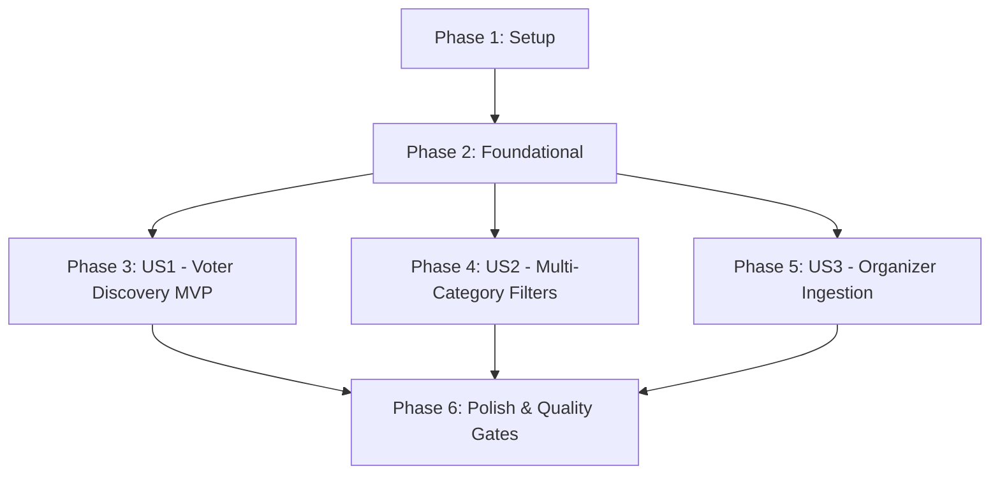

# Tasks: Contestant Profiles & Multi-Media Showcase

**Feature**: `002-contestant-profiles`  
**Spec**: [spec.md](file:///c:/Users/Roselle%20Tabuena/workspace/vote-sphere-workspace/vote-sphere/specs/002-contestant-profiles/spec.md) | **Plan**: [plan.md](file:///c:/Users/Roselle%20Tabuena/workspace/vote-sphere-workspace/vote-sphere/specs/002-contestant-profiles/plan.md)  
**Ticket**: `VS-19` (Parent Epic `VS-20` / Story `VS-21`)  
**Status**: Ready for Implementation

---

## Phase 1: Setup (Shared Infrastructure)

**Purpose**: Initialize storage configuration and vertical feature slice structure.

- [x] T001 Configure Supabase Storage bucket `contestant-media` policy and configuration in `supabase/config.toml`
- [x] T002 [P] Create feature directory structure under `src/features/contestants/` (`components/`, `hooks/`, `types/`, `utils/`)

---

## Phase 2: Foundational (Blocking Prerequisites)

**Purpose**: Database schema expansion, Prisma migrations, and core validation utilities.

> **CRITICAL**: Foundational tasks must be completed before User Story implementation.

- [x] T003 Update Prisma schema with `ContestantDivision`, `ContestantStatus`, `MediaType`, `EmbedPlatform`, `ContestantMedia`, `AwardCategory`, and `ContestantCategoryAssignment` in `prisma/schema.prisma`
- [x] T004 Generate and execute Prisma migration for contestant profile expansion via `npx prisma migrate dev`
- [x] T005 [P] Define TypeScript interfaces, DTOs, and enums in `src/features/contestants/types/index.ts`
- [x] T006 [P] Implement multi-platform video embed URL parser for YouTube Shorts/Videos, TikTok, Instagram Reels, and Facebook Videos/Reels in `src/features/contestants/utils/parse-video-embed.ts`
- [x] T007 [P] Implement social media handle and URL normalization utility in `src/features/contestants/utils/normalize-social-links.ts`
- [x] T008 [P] Implement Zod validation schemas for contestant CRUD, media, and status in `src/lib/validations/contestant.ts`
- [x] T009 [P] Unit tests for video embed parser and social link normalizer in `tests/unit/contestants/video-embed-parser.test.ts`
- [x] T010 [P] Unit tests for contestant Zod validation schemas in `tests/unit/contestants/contestant-validation.test.ts`

**Checkpoint**: Foundation ready — database models migrated, type definitions exported, validation schemas tested.

---

## Phase 3: User Story 1 - Voter Candidate Discovery, Media Reel & Detail Inspection (Priority: P1) 🎯 MVP

**Goal**: Deliver voter candidate discovery with 4:5 vertical portrait cards, 10-photo swipeable lightbox carousel, embedded video reels (YouTube Shorts, TikTok, IG, FB), and bio dossiers.

**Independent Test**: Navigate to `/events/[slug]`, view contestant roster, click a candidate card, swipe through photo gallery, play embedded video reel, and inspect advocacy statement and social links.

### Tests for User Story 1

- [x] T011 [P] [US1] Unit test for ContestantCard and PhotoGalleryCarousel rendering in `tests/unit/contestants/contestant-card.test.ts`

### Implementation for User Story 1

- [x] T012 [P] [US1] Implement public contestants list Route Handler `GET /api/events/[slug]/contestants` in `src/app/api/events/[slug]/contestants/route.ts`
- [x] T013 [P] [US1] Implement single contestant detail Route Handler `GET /api/events/[slug]/contestants/[contestantId]` in `src/app/api/events/[slug]/contestants/[contestantId]/route.ts`
- [x] T014 [P] [US1] Implement TanStack Query hook `useContestants` in `src/features/contestants/hooks/use-contestants.ts`
- [x] T015 [P] [US1] Implement 4:5 luxury portrait candidate card component `ContestantCard` in `src/features/contestants/components/ContestantCard.tsx`
- [x] T016 [P] [US1] Implement 10-photo swipeable gallery carousel with thumbnail strip `PhotoGalleryCarousel` in `src/features/contestants/components/PhotoGalleryCarousel.tsx`
- [x] T017 [P] [US1] Implement responsive embedded video reel player `VideoReelPlayer` in `src/features/contestants/components/VideoReelPlayer.tsx`
- [x] T018 [US1] Implement candidate detail modal and dossier `ContestantProfileModal` in `src/features/contestants/components/ContestantProfileModal.tsx`
- [x] T019 [US1] Integrate `ContestantRoster` into public event page in `src/app/(public)/events/[slug]/page.tsx`

**Checkpoint**: User Story 1 complete — public visitors can explore candidates, browse 10-photo galleries, and watch embedded video reels.

---

## Phase 4: User Story 2 - Multi-Category & Division Filtering (Priority: P2)

**Goal**: Provide instant category and division switching across Male, Female, LGBTQ+, Teen, and specialized award tracks with URL synchronization.

**Independent Test**: Toggle division and award category tabs on the event page and verify candidate grid filters instantly (< 100ms) with URL parameter updates.

### Tests for User Story 2

- [x] T020 [P] [US2] Unit test for category and division filtering logic in `tests/unit/contestants/category-filter.test.ts`

### Implementation for User Story 2

- [x] T021 [P] [US2] Implement award categories list Route Handler `GET /api/events/[slug]/categories` in `src/app/api/events/[slug]/categories/route.ts`
- [x] T022 [P] [US2] Implement TanStack Query hook `useCategories` in `src/features/contestants/hooks/use-categories.ts`
- [x] T023 [P] [US2] Implement division and award category filter bar `CategoryFilterBar` with `nuqs` URL state synchronization in `src/features/contestants/components/CategoryFilterBar.tsx`
- [x] T024 [US2] Connect category and division filters to `ContestantRoster` with smooth layout transitions in `src/features/contestants/components/ContestantRoster.tsx`

**Checkpoint**: User Story 2 complete — seamless division and award category filtering operational.

---

## Phase 5: User Story 3 - Organizer Contestant Management & Media Ingestion (Priority: P3)

**Goal**: Provide event organizers with a self-service management panel to add, edit, crop 4:5 photos, preview video embeds, assign categories, and manage lifecycle status (`ACTIVE`, `HIDDEN`, `WITHDRAWN`).

**Independent Test**: Login as organizer, create a new contestant with cropped photo and video embed, assign categories, modify status, and verify immediate reflection on public roster.

### Tests for User Story 3

- [x] T025 [P] [US3] Unit tests for organizer mutation validation and status transitions in `tests/unit/contestants/organizer-contestant.test.ts`

### Implementation for User Story 3

- [x] T026 [P] [US3] Implement client-side 4:5 aspect ratio cropping canvas `ImageCropper` in `src/features/contestants/components/ImageCropper.tsx`
- [x] T027 [P] [US3] Implement contestant creation Route Handler `POST /api/events/[slug]/contestants` with organizer session check in `src/app/api/events/[slug]/contestants/route.ts`
- [x] T028 [P] [US3] Implement contestant update and deletion Route Handler `PATCH / DELETE /api/events/[slug]/contestants/[contestantId]` in `src/app/api/events/[slug]/contestants/[contestantId]/route.ts`
- [x] T029 [P] [US3] Implement contestant lifecycle status Route Handler `PATCH /api/events/[slug]/contestants/[contestantId]/status` in `src/app/api/events/[slug]/contestants/[contestantId]/status/route.ts`
- [x] T030 [P] [US3] Implement TanStack Query mutation hooks in `src/features/contestants/hooks/use-contestant-mutations.ts`
- [x] T031 [US3] Implement organizer contestant curation form modal `ContestantFormModal` with image cropper and video embed preview in `src/features/contestants/components/ContestantFormModal.tsx`
- [x] T032 [US3] Add status toggle controls and contestant management table in organizer dashboard view in `src/features/contestants/components/OrganizerContestantTable.tsx`

**Checkpoint**: User Story 3 complete — organizer roster curation and status management fully operational.

---

## Phase 6: Polish & Cross-Cutting Concerns

**Purpose**: Seed data enrichment, end-to-end quickstart validation, and zero-regression quality checks.

- [x] T033 [P] Update seed script with rich multi-photo candidates, categories, and video embeds in `prisma/seed.ts`
- [x] T034 [P] Run typecheck and linting across codebase (`npm run typecheck && npm run lint`)
- [x] T035 Run full automated test suite with Vitest (`npm run test:unit`)
- [x] T036 Execute manual quickstart verification scenarios from `specs/002-contestant-profiles/quickstart.md`

---

## Dependencies & Execution Order

### Parallel Opportunities

- **Phase 1**: `T002` can execute in parallel with `T001`.
- **Phase 2**: `T005`, `T006`, `T007`, `T008`, `T009`, `T010` can all be executed in parallel once migration `T004` completes.
- **Phase 3**: `T011`, `T012`, `T013`, `T014`, `T015`, `T016` can run concurrently across API and UI primitives before modal assembly in `T018`.
- **Phase 4 & 5**: Can execute independently once Phase 2 foundational prerequisite is satisfied.

---

## Implementation Strategy (MVP First)

1. **Sprint 1 (MVP)**: Deliver **Phase 1**, **Phase 2**, and **Phase 3 (User Story 1)**.
   - Result: Public voters can explore 4:5 contestant portrait cards, swipe through 10-photo galleries, and play embedded video reels.
2. **Sprint 2**: Deliver **Phase 4 (User Story 2)**.
   - Result: Division & award category filtering with `nuqs` URL sync.
3. **Sprint 3**: Deliver **Phase 5 (User Story 3)** and **Phase 6 (Polish)**.
   - Result: Organizer self-service curation, image cropping canvas, and full test suite passing.
